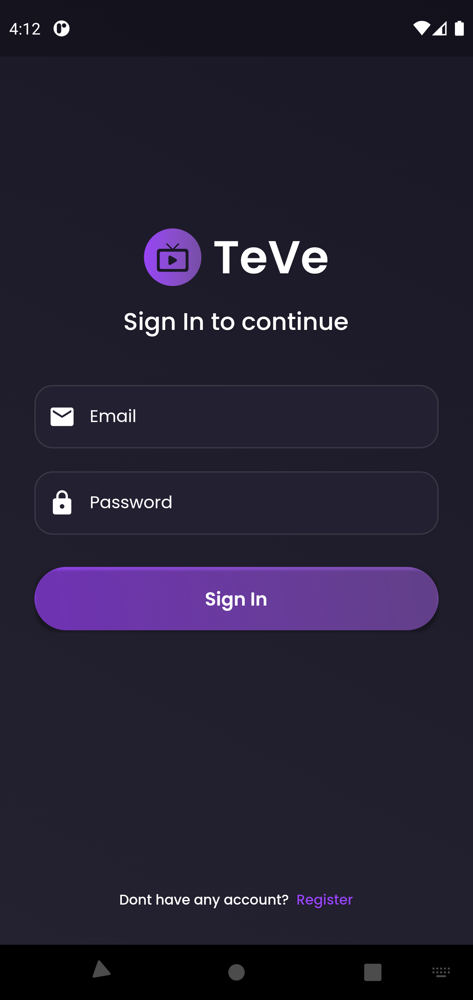
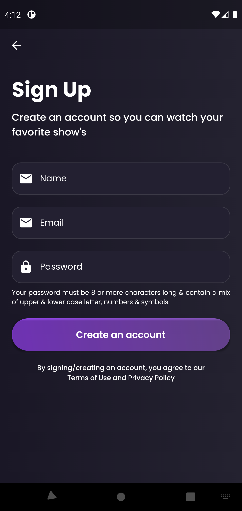
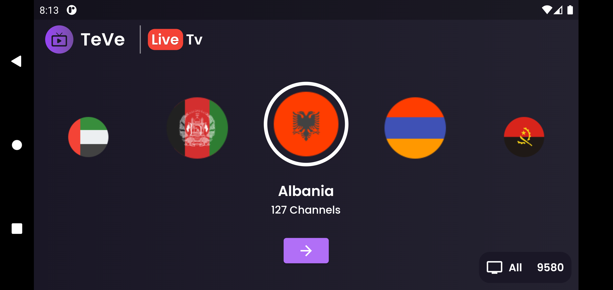
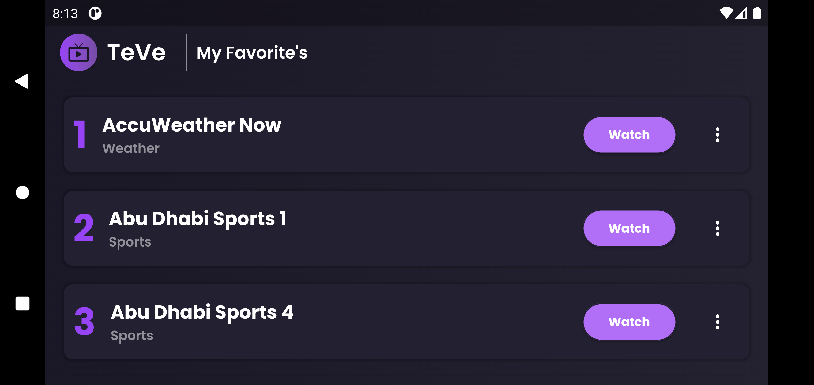
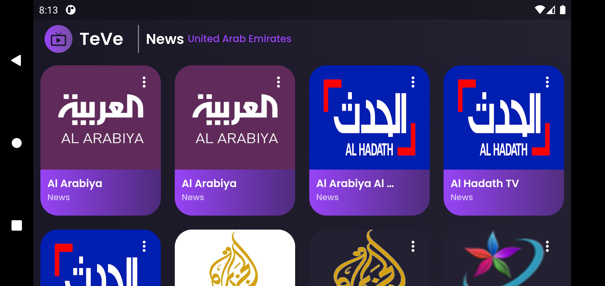

<h1 align="center">
A Free IPtv Player
</h1>


# 📺 **TeVe** 

A cross platform **IPTv player** developed for Android/IOS.

You can watch and add channels to your favorite list from all around the globe. You can access channels according to your preference of choice or based upon your country. 

This app contains roughly [10,000 channels](https://iptv-org.github.io/iptv/channels.json) that are freely available to watch. 

## **Overview**

The app uses the [IPTV API](https://iptv-org.github.io) as a data sources and uses the standard dart libraries for making network requests.

In terms of UI, the goal was replicating the Android design as closely as possible to understand the possibilities that Flutter offers for crafting UIs.

## **Screenshots**
Login | SignUp
---|---
 | 
<br />

Home |
---|
 
  
<br />

Favorite's Page |
---|

<br />

Channel Page |
---|


## **Requirements**
- Any Operating System (i.e. MacOS X, Linux, Window)
- Any IDE with Flutter SDK installed (i.e. IntelliJ, Android Studio, VSCode etc)
- Knowledge about Dart and Flutter

## **Features**

- [x] Login
- [x] Sign Up
- [x] View Live Stream
- [x] Add to Favorites
- [x] Sort by Country

## **API Reference**

> API used : https://iptv-org.github.io

#### Get all channels

```
  GET /api/channels.json
```

| Parameter | Type   | Response           |
| :-------- | :----- | :----------------- |
| `none`    | `none` | `List of Channels` |

## **Backend**

Backend was developed using fast API and Sqlite

> API used : https://web-7-ush.cloud.okteto.net

Check following repository to know more about [**Teve-Backend**](https://github.com/7-USH/Teve-Backend).

## **Credits**

- [IPTVify App Ui Design](https://dribbble.com/shots/14754204-IPTVify-App-Ui-Design)
- [IPTV Github Repository](https://github.com/iptv-org/iptv)
