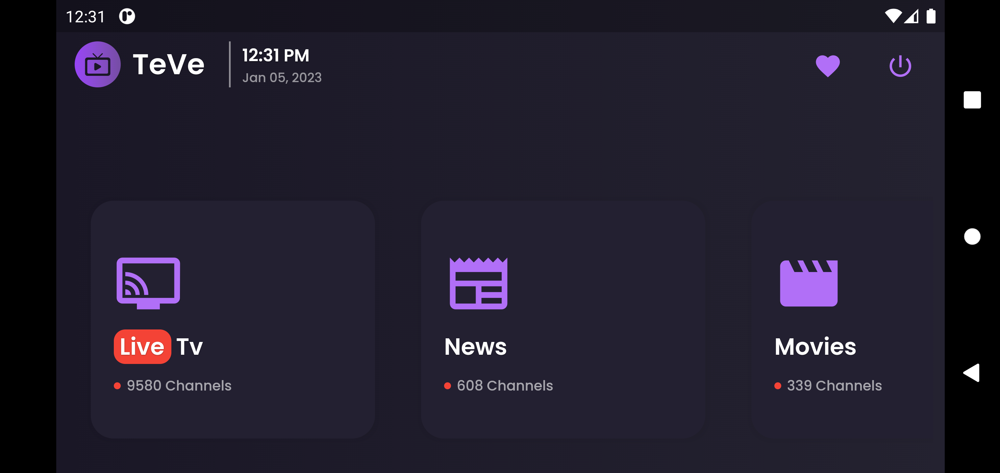

# 📺 **TeVe** 

A cross platform **IPTv player** developed for Android/IOS.

## **Screenshots**
Login | SignUp
---|---
 | 
<br />

Home |
---|
 
|   
<br />

Favorite's Page |
---|

<br />

Channel Page |
---|


## **Requirements**
- Any Operating System (i.e. MacOS X, Linux, Window)
- Any IDE with Flutter SDK installed (i.e. IntelliJ, Android Studio, VSCode etc)
- Knowledge about Dart and Flutter

## **Features**

- [x] Login
- [x] Sign Up
- [x] View Live Stream
- [x] Add to Favorites
- [x] Sort by Country

## **API Reference**

> API used : https://iptv-org.github.io

#### Get all channels

```http
  GET /iptv/channels.json
```

| Parameter | Type   | Response           |
| :-------- | :----- | :----------------- |
| `none`    | `none` | `List of Channels` |

## **Backend**

Backend was developed using fast API and Sqlite

> API used : https://web-7-ush.cloud.okteto.net

Check following repository to know more about [**Teve-Backend**](https://github.com/7-USH/Teve-Backend).

## **Credits**

- [IPTVify App Ui Design](https://dribbble.com/shots/14754204-IPTVify-App-Ui-Design)
- [IPTV Github Repository](https://github.com/iptv-org/iptv)